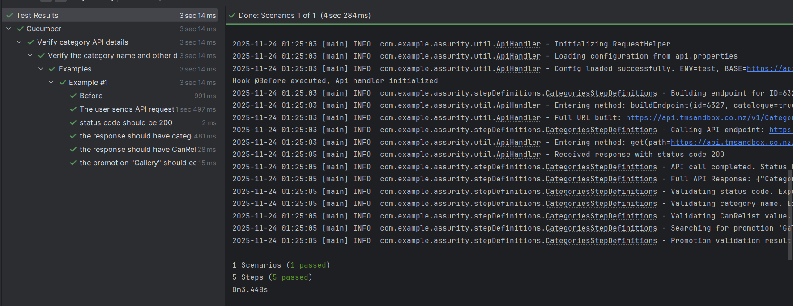
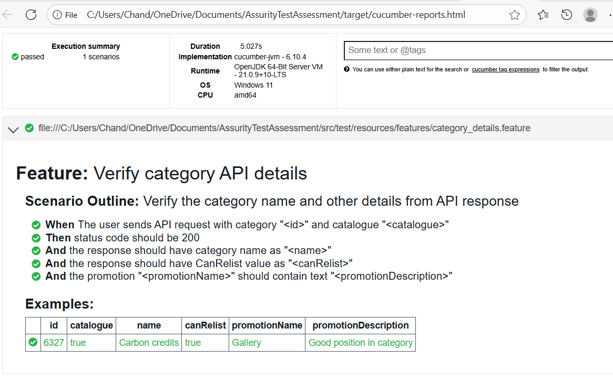
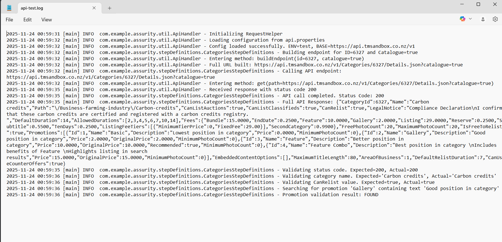

# **Assurity Assessment - API Test**

## Project Overview

assurity-api-tests is an automated API testing project built with Java, Cucumber, JUnit, and RestAssured.

The project includes:

* Behavior-Driven Development (BDD) style tests using Cucumber.
* API test automation using RestAssured.
* Logging using Log4j2.
* HTML test reports generated.

This project is intended to validate API endpoints and automate functional testing for REST services.

## Project Structure

assurity-api-tests/
├── pom.xml                         # Maven configuration
├── src/
│   └── test/java
│       ├── hooks/                  # Hooks class
│       ├── runners/                # Test runner classes (e.g., RunCucumberTest.java)
│       ├── stepDefinitions/        # Step definition class
│       └── util/                   # Utility class
│   └── test/resources
│       ├── config/                 # Env file
│       └── features/               # Cucumber feature file
├── target/                         # Maven build output
│   ├── logs                        # Console output
│   └── cucumber-reports.html/      # Generated HTML report

## Prerequisites

Before running tests, ensure the following are installed and environment variable are set correctly:

* Java JDK 11 or higher
* Maven 3.6+

## Check versions:

* java -version
* mvn -version

## Dependencies

The project uses:

* Cucumber 6.10.4 – BDD framework
* JUnit 4.13.2 – Test runner
* RestAssured 4.4.0 – API testing
* Gson 2.8.9 – JSON handling
* Log4j2 2.22.1 – Logging

Dependencies are managed via Maven (pom.xml).

## Clone the Repository
To clone this project, run the following command. 
git clone https://github.com/chandra0310/AssurityTestAssessment.git

## Running Tests

### Run Cucumber Tests

Use Maven Surefire plugin to run tests:

* mvn clean test

This will execute all tests in from teh feature file as per RunCucumberTest.java. A HTML report will be generated at:

target/cucumber-report.html

## Logging

* Log4j2 is configured in the project.
* Logs are printed to the console and are also written to file target/logs/api-test.log

## Troubleshooting

***Directory not found***

Maven will usually create directories automatically. If not, create: target/logs/

## Useful Maven Commands

**Command \\Description**

* mvn clean compile - Clean \& compile the project
* mvn clean test - Run tests and generate JSON report
* mvn verify - Generate HTML report from JSON
* mvn dependency:tree - View dependency tree

## Test Result

**IDE Test Result**

**HTML Report**

**Console Log**

